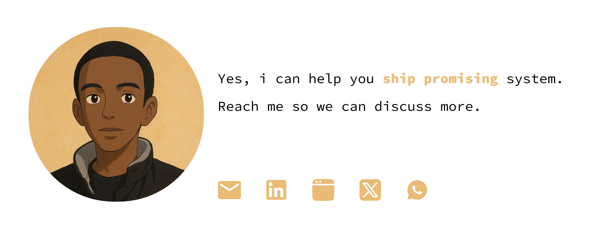

# Hi, I'm **Maximillien** 👋

I'm passionate about AI, RoboTech, coding and design.

  
  <h2 align="center">GitHub Profile Trophy</h2>
  
🏆 Add dynamically generated GitHub Stat Trophies on your README

## 🛠 **Skills**

- AI & Machine Learning, Web Development & Startup Building
- Embedded Systems, IoT and Robotics
- Figma, XD, Framer and SolidWorks

## 📂 **Projects**
- [Kira](https://github.com/maximillien/kira) - SMS-based medication reminder platform

## 📊 **GitHub Stats**

##**Banner**

